# 2022大前端总结和2023就业分析

本文首发[CNode社区](https://cnodejs.org/topic/63ddd83cc903c20eb74ebde8)、[SegmentFault](https://segmentfault.com/a/1190000043384541)、[稀土掘金](https://juejin.cn/post/7196110128038690876)、[知乎](https://zhuanlan.zhihu.com/p/603410758)和[Node全栈公众号](https://mp.weixin.qq.com/s?__biz=MzAxMTU0NTc4Nw==&mid=2661158082&idx=1&sn=7f7309169915c3a17ed84f09ac68e83e&chksm=80d5d116b7a258006366ccc4137b7eefc2336417022ec3b585a48970488d5b01ba5909ddf884&token=1266164736&lang=zh_CN#rd)，本文版权归作者所有，未经作者同意，禁止转载。

**狼书三卷已出版，感兴趣的同学加我的微信langshunode，可以加读者群。**

我在年前给掘金平台分享了《2022年热点技术盘点》的前端热点，算是系统性的梳理了一下我自己对前端一整年的总结。年后，在知乎上看到《前端的就业行情怎么样？》，下面都是各种唱衰前端的论调，什么裁员，外包化，没前途，薪资不过20k之类的，我非常不认同他们的观点，于是我也回复了这个提问，基于前端情况、趋势和我个人的理解，给出了一些就业行情分享，大家还是比较认可的，收藏的比点赞的还多。既然都喜欢看，那我就把这些人写的稍微详细一下，希望有理有据的分析能够对更多前端的朋友们在寒冷的冬天，感受到更多温暖，更加坚定。

本文主要讲了前端2022的主流趋势，年度大戏低码和2023就业行情分析，对未来的2个可能放大的点AI和Cropto和前端相关的部分也有一点点覆盖。2022年是黑天鹅满天飞的一年，整个互联网局势都很差，从人才济济到“人才挤挤”，2023年前端就业形势会怎样呢？下面一起来尝试分析一下。

## 先看一下2022年前端主流趋势

2022年的前端还是非常热闹的，比如Vite和Turbo的性能之争，恶劣的Faker.js事件，尊重但不一定认同的SubStack退网事件，已知多位大佬加入区块链公司，Doodlewind在AFFiNE做编辑器，Justjavac在Deno & Rust之外又参与了Astro源码贡献，Antfu开源的Vitest非常棒，如果评年度卷王2位，一定会有Antfu。如果只评一位，那么一定是Jarred-Sumner，他是Bun.sh作者，Bun是2022年的性能最好的Runtime，风光一时无二，从 2021 年 4 月初始提交至今已有超过百万行的代码增删量，单人完成了 98% 以上的提交量，2月3日刚发布了Bun v0.5.5。

通过我的种种观察，我的分析是前端专业成熟度基本上见顶了，基建基本稳定，2022年做的事都是深耕基建和前端垂类细化，整体看是围绕研发体验优化做的事儿为主，各垂类全面专业化。下面围绕性能、运行时、体积、Rust等四个方面进行讲解。

### 当前前端趋于成熟
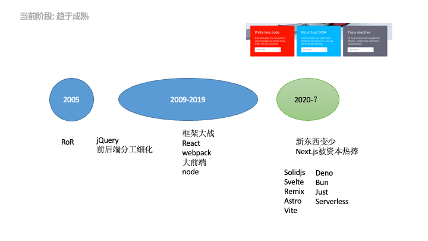

从2005年之后，相继出现Prototype，Motools，jQuery等为了抹平浏览器差异的库，极大的降低了全栈开发门开。随着电商高速发展，促成了前后端分离，并最终催生了前端工程师这一专业工种。

在2009年，Node.js横空出世，由于Node.js使用V8这个最高效的JavaScript引擎，所以在语法上，对前端更友好，或间接或直接的促进了前端构建领域的日渐成熟，比如对html不满足，就有了Pug、ejs等模版，比如css不满足，就有了sass，less等CSS预处理器，比如js不满足，就开始有了Coffee等新的衍生语言。除此之外，在模块规范层面也是有了很多演进，从AMD到CommonJS到UMD，完成了很多优秀的探索，比如require.js，sea.js这样的优秀实践。另外JavaScript语言本身也取得非常大的发展，从ES5一路升级，在TC39组织下每年一个版本，为了兼容各个版本特性，诞生了Babel这样的超级怪物，当然这样间接的解决了异步流程控制问题，从Callback hell到Promise到Generator到Async function，虽然很乱，到总归是回到了正路上。除了这些基础外，在UI框架层面也做了大量实践，从早年各种hack面向对象基础，到extjs类的面向对象的开发方式，甚至是从Flex、Silvelight等富客户端，但都是惊鸿一瞥，未能一直称雄。

随后2013年之后，开始出现Backbone，Angular类似插件，将MVVM、IoC、指令等引入到前端，继而促使React、Vue在DSL，VDom层面展开激烈角逐，并促成了React、Vue、Angular三家争霸的局面。同时，也使得分散的技术栈开始变得不满足构建需求，于是从Grunt、Gulp等传统构建器，演进为以Webpack代表的打包器(Bundler)。

这还只是前端爆发的开始，2015年之后，Node.js开始稳定在1.0版本，并持续发力，使得BFF（backend for frontend）遍地开花。同时围绕React、Vue、Angular三大框架的移动端开发也如火如荼，比如react-native、weex等都变得流行起来，几乎是强运营场景下必备的神器。

从2013到2019年间，是大前端的爆发式增长期。从前端基建，跨端，BFF（backend for frontend）等领域都取得了极大的进步，这也促使前端人才需求极大，尤其是对专业型人才需求极大，薪资也是可以用“狂飙”来形容。可以说这6年是前端发展最好的时期，Java自从被Spring包养之后变化不大，移动端更是在2015年下半年之后开始式微，在这种情况下，只有前端几乎是唯一大的增长点。很多人黑前端娱乐圈，屁大点事儿都能被放大到很大，这种聚光灯效应足以说明大家对前端的关注点。

甚至那几年有前端同学调侃说：“学不动了”，就是因为三大框架生态和大前端的快速发展导致的。但，2020年之后，基本上就没有人这样说了，前端的新轮子也不再那么高频率出现了，就连几个核心框架，更新的内容也都开始挤牙膏了，甚至是互相借鉴。这就意味着前端成熟度已经趋于平稳，剩下的事儿就是如何趋于成熟。我们看一下这2年前端所发生的变化也确认如此，你能看到的变化，已经不是轮子上的广度上追求变化，而是更多的聚焦核心场景围绕深度上进行探索，这就在稳定性和开发者体验上做更多努力，这是极好的变化。

这里以Svelte为例，它甚至还有点返祖，它官方介绍的特性就是：写更少的代码（开发者体验），无VDom（性能），真正反应式（开发者体验）。基本上也都是围绕开发者体验和性能2个方面进行创新的。

下面就当下新潮的技术（Solid.js、Svelte、Remix、Astro、Vite、Bun、Tauri、Turbo等）进行总结，围绕性能、运行时、体积、Rust四方面分别讲解，具体如下。

### 1、性能
先看一下为什么会有性能问题，问题和解法如下。
1、启动时间慢，大家都受够了Webpack阵营：于是就有了swc、esbuild这些编译器，以及Turbo、Vite这样的基于新编译器的构建方式。
2、配置太多：约定大于配置或0配置的开箱即用
3、包太大，动不动1个G的NPM包大小：Yarn，pnpm。有朋友开玩笑，1个G不大，可是电脑才256个G的硬盘。
4、模块拆分：Lerna | Yarn/ pnpm workspace。

其实都是在解决大规模编程问题，如果再直接点说，那就是解决的是开发者自己的体验问题。整体看前端生态真的做的已经很好，吊打其他社区包管理机制。某一次我在知乎上看到一个回答，往死里骂npm，然后我就简单的拿NPM和Cargo对比了一下，结果那位回答的人来质问我不能这样比。这就是典型中国人，自己孩子随便骂，别人说一声都不行。如此看来，我这激将法还是管用的。

下面是Umi作者云谦大佬整理的性能比较数据，以及Vercel官方对比的Vite和Turbo数据对比。至于具体数据大家不必详细看，数据在变，不同基准下也是有影响的。之所以放这2张图，就是想让大家了解一下，当前几个主流框架里都在做性能竞赛，这里面最有代表性的就是Webpack5，Vite和Turbo。

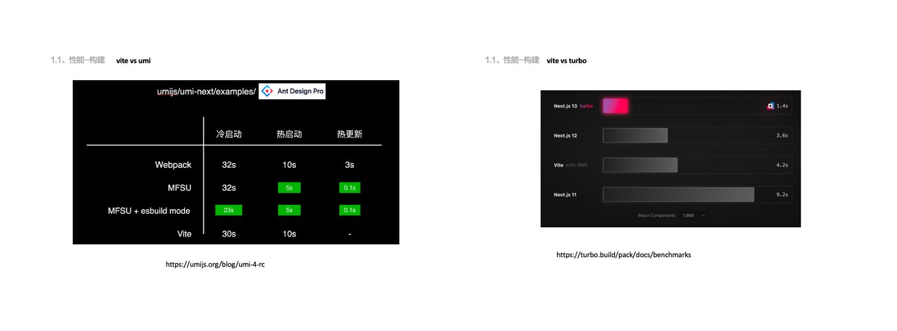

围绕构建工具，我曾经画过一张图，基本讲清楚了前端的构建演进历史。参考下图。

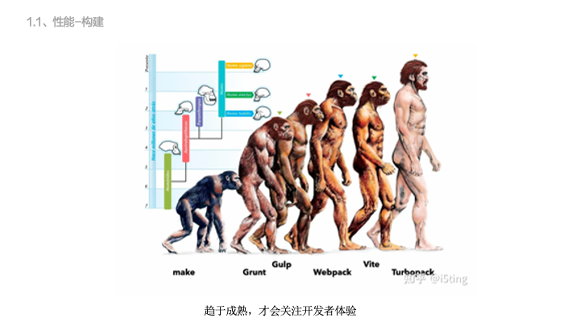

最开始的时候，很多前端，包含Node.js工程师都是使用make作为构建工具的，如果大家感兴趣，可以去看看tj早年项目结构（其实，《深入浅出Node.js》里也是用到make的，朴大大也很喜欢make）。之后就是Grunt，基于模版和插件机制的构建工具，比如jQuery等都是基于Grunt构建的。但Grunt有2个问题，就是性能不太好，另外配置复杂。于是Gulp横空出世，很快就替代了Grunt，它是基于Node.js stream机制做，只要机器有资源就可以完全利用上，在效率上比基于文件模版的方式高出一大截。即使在今天看，Gulp也是极为优秀的构建方案。
但前端发展非常快，各种CSS预处理器，模版，语言，还有Babel等各种兼容，于是就有了Webpack这样的Bundler，通过插件和loader机制，把前端这点乱七八糟的快速发展产物整理的顺畅很多，在很长很长一段时间，Webpack都随着三大框架一起成长，结果臃肿，笨重，一个稍大一点的项目几秒到几十秒都是常事。那个时候，没的选，学东西都来不及，温饱还没解决，谁还有心思想什么马斯洛需求层次理论啊。

到2019年之后，开始出现Snowpack，主要是针对ESM进行Bundless打包方案，随后Vite也借鉴了Snowpack的思路，提升开发者体验，并以Rollup和esbuild生态辅助，以高明的设计，最小的投入，获得社区快速的认同，有点像当年Gulp替代Grunt一样。按照正常剧本的话，Vite会和Gulp一样大火。偏偏半路杀出一个程咬金，Vercel开源了Turbo，以Rust做基建，拿Rust优势为底，重写底层工具链，从根上开始杠，做了一个硬核的事儿。

其实，充分竞争是好的。如果性能提升10倍，甚至100以上，这对开发者是多么大的体验提升啊。不管最终胜者是Vite，还是Turbo，或者其他，都无所谓，我们能看到的是未来前端开发会非常幸福。

### 2、运行时
2013到2019年，TC39组织发展的非常快。曾经阿里，360都以能加入TC39为荣，能够从语言这样的底层规范上参与，能够很大程度提升中国前端的影响力。比如2021年阿里巴巴提案Error Cause 进入Stage3，也是当年很火的新闻。但实际上经过这么多年的发展，能提的都提了，能借鉴的也都借鉴了，就好比现在Node.js源码想去提个PR是不容易的一样。

2022年最火的一个项目是Bun.sh，官方介绍Bun是一个快的JavaScript运行时，且all in one，就是说它内置包管理。基于Zig和uWebSockets，性能是极好的。

其实，Node.js从2009诞生之后，除了当年iojs分家又合并的事外，就是ry另立门户做的Deno，其实它也是一个JavaScript运行时，无非是对浏览器和最新标准支持的更好，加上对TypeScript直接支持，开箱即用是非常好的设计。

我们可以把Node.js、Deno、Bun放在一起走一个简单的对比，具体如下。

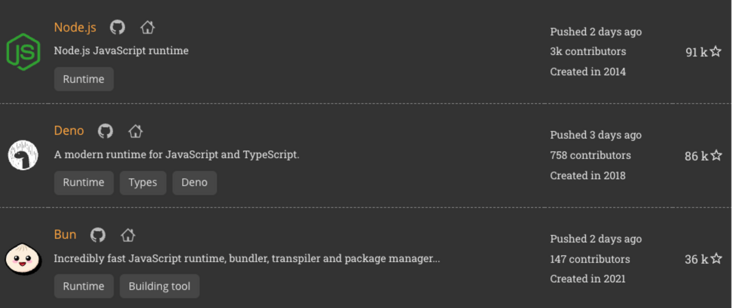

它们都是非常优秀的JavaScript运行时，无论是star数，更新频度，贡献者都是非常健康的。图中有一个错误，说Node.js是创建于2014年，这其实是iojs合并回来的时间，实际上Node.js是2009年。

去年之所以Bun爆火就是因为它的性能极好，下面我们看一下Bun的性能，分别是Bun v0.1和v0.4的性能对比。

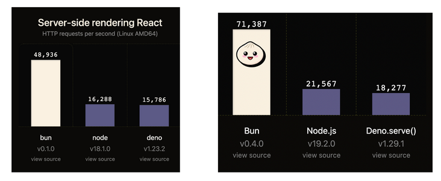

通过上图，可以明显的看出，Bun的性能基本上是Node.js和Deno的3倍左右。但只看数据其实是不合适的，按太郎的说法: “等 Bun 把所有的 **SegmentationFault**, **Illegal instruction** 和 **version 'GLIBC_2.29' not found **修完了以后性能会回到 Node.js/Deno 水平”，我是非常认同这个说法的。

当然，Node.js也有它的问题，尾大不掉，很多东西想改也是没法的。事实上，Node.js更新的也是非常多的，比如Deno引以为豪的network import，在Node.js v17.6里就实现了，除了直接ts没有支持外，其他差别就不大了。

针对Runtime这块，Bun的思路是对的，all in one，不过我更希望有一个集合3个Runtime的优势的Runtime，比如支持network import，自带包管理，原生支持Typescript。想想，对Node.js开发者来说，那也是很美好的事儿。其实就是歪歪一下而已，Node.js已经很难做改造了，不然也不会在Serverless容器里因为冷启动时长过长，而导致很多公司自己定制Runtime，比如阿里去年开源的noslate便是因为这个原因鼓捣出来的。

这里再稍微啰嗦一点，除了Runtime层面，其实在应用层面性能也是有提升，比较典型的例子是Deepkit，Deepkit的做法是将 TypeScript 转换到字节码，提供反射 开箱即有类型转换、序列化/反序列化器，验证器和自动类型守卫，所有的 TypeScript 类型都受支持。在@deepkit/core里使用很多hack技巧，比如用new function来创建新的动态类。但由于类型上做了大量优化，包括bson解析，RPC协议优化等方面有非常大的优势，所以在DB和RPC性能方面是非常不错的。除此之外，它在调试方面也是非常方便的。参见下图。

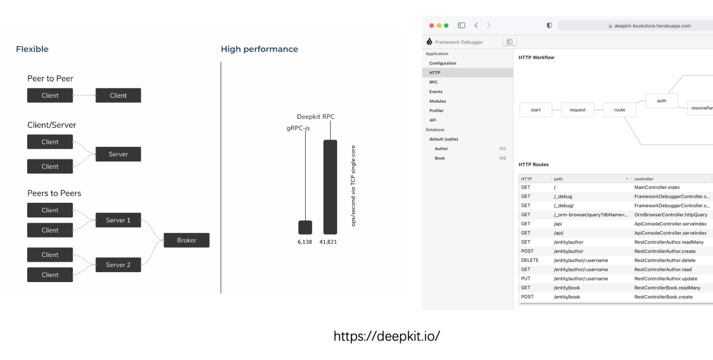

就目前deepkit情况而言，它是非常优秀的项目，deepkit目标非常远大，它自己也实现Web server，但性能和Fastify比还是有一定差距的，可以关注一下。

除了deepkit之外，其实还有一些社区想法也是可以关注的，对提升性能都是比较好的解法。

- [https://arrow.apache.org/](https://arrow.apache.org/)基于内存的列式数据结构，目前Node.js社区这方面实践还少。
- [https://github.com/sysgears/webpack-virtual-modules](https://github.com/sysgears/webpack-virtual-modules) 能内存解决的事儿都内存做吧。在vm2里可以使用require file from memfs ，这也是一个不错的方式，参见[https://github.com/patriksimek/vm2/issues/472](https://github.com/patriksimek/vm2/issues/472)
- Partytown 拆到worker里，分而治之也是极好的。
- Cyberscript，基于zig的脚本：基于寄存器做编译，也是抠性能抠到一定程度了。

### 3、体积
通常产品开发都是先实现功能，然后再优化，然后再做周边。其实这种思路在大前端生态里也是这样的。举个例子，SSR就是非常典型的例子。以淘宝的活动页为例，早年一直是没有SSR支持的，后来拉新需求以及技术突破，自然而然就会做SSR了。就好像我当年使用SSR，总会被问到SSR的价值，明明就是锦上添花的技术，为什么一定要用，原理是一样的。当你想提升性能的时候，除了万金油缓存外，减小体积就是最简单的方式，SSR就是最典型的实现，当下SSR、SSG等已经成了前端标配，像astro也是在体积上做了大文章的优秀项目。

除了前端体积外，跨度领域其实也是在优化的。这里举一个2022年轮子哥Egoist的一个项目dropcode，颇具有代表性。dropcode技术栈和ui如下图。

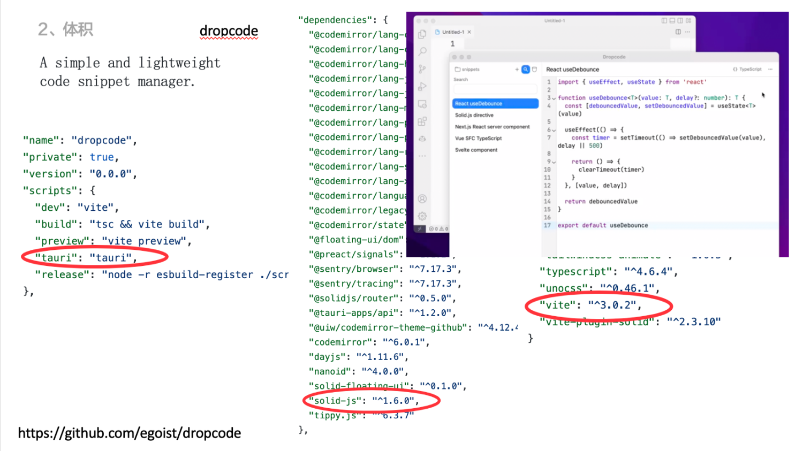

dropcode就是一个简单的管理代码片段的软件，它的技术栈是很潮的，采用Tauri做打包，采用Vite做构建，采用Solid.js做ui框架，这三个大杀器都是非常优秀的。

- Tauri是Rust编写的跨端构建方案，优点是基于Web技术可以打出比Electron更小的包。体积小10倍以上。
- Vite是基于ESM的方案，在体积和性能上也是极为优秀的，丝般顺滑。
- Solidjs是一个react类dsl增强的优化框架，7kb的包，也是把体积做到极致了。createSignal不评价，优点缺点都有的。

关于Tauri这里是有必要讲一下，它是Rust的代表应用之一，在跨端构建领域也算一时风光，大有取而代之的意思。下面是Tauri的架构图和功能对比。

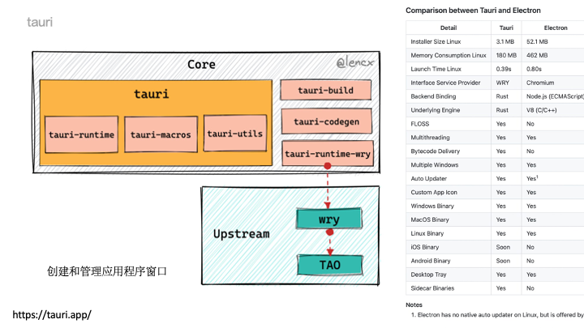

上图右侧对比功能基本差不多，Linux系统的安装包大小是非常值得关注的，将近20倍，这也是最吸引开发者的特性。从Tauri架构上来看，设计的是很合理。

1、TAO是创建跨平台应用窗口的库，支持所有主要平台，除了PC，还有iOS和Android，野心还是很大的。
2、WRY是基于Tao构建的跨平台Webview渲染库。
3、核心是Tauri Runtime和周边。

接下来我们对比一下Tauri和Electron。从Tauri v1.2发布声明上看，它是使用Rust编写的，构建优化过的，安全的，前端独立的应用多平台打包软件。

这里重点介绍一下构建优化，主要是它的tao和wry使用各个操作系统的内置Webview，而不是像Electron内置Chromium。所以在安装包大小上，具有绝对优势。但辩证的看，使用系统内置的Webview，Webview兼容性是个大问题，会不会出现ie6类的兼容问题不好说。而Electron是所有平台展示都一样，这就是拿体积换体验一致。参考下图，了解一下就好。

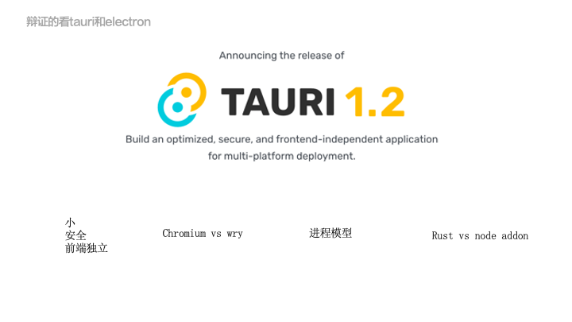

下面看一下Tauri相关应用场景，2022年最火的软件大概Chatgpt，围绕Chatgpt衍生出很多周边，通过Tauri打包chatgpt，lencx的做法就非常不错，目前已经超过6.9k star数了。另外一个应用就是侑夕写的pake，这是一个简单的基于Tauri的封装，但用法却极为简单，可以让网页快速变成pc应用。试用了一下，非常的舒服，短短几个月就10.2k star数了。

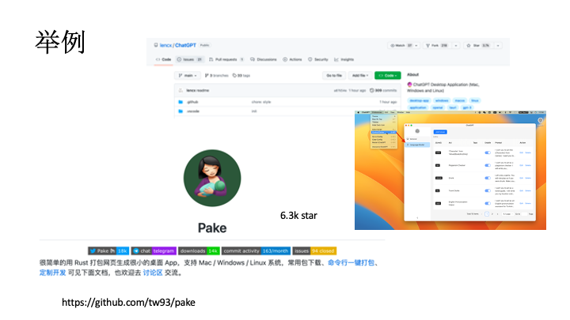

大家对体积和性能的关注是一样的，除了Tauri外，Node.js社区里也有Gluon这样的方案，都是采用系统Webview，不过目前Gluon还是处于比较初级阶段，可以关注一下。下面是Gluon官方给出的对比图。就性能和体积来说，Gluon和前面讲的Bun类似，希望它们都能够发展的越来越好。

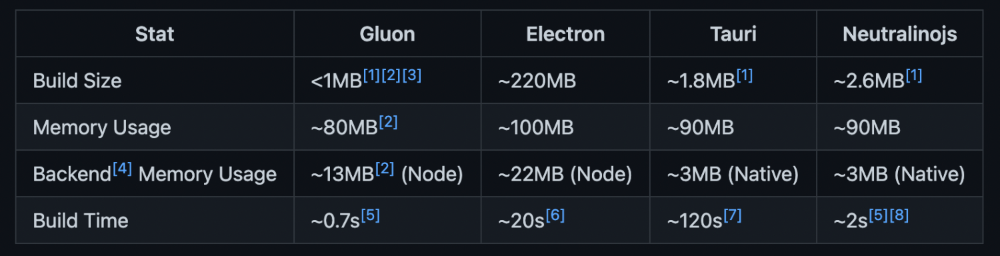

从SSR，到Solidjs，到Vite，到Tauri，到Gluon，都是在体积上做了很大优化的优秀技术，我相信未来还会不断在体积和性能优化方案深究，这对用户和开发者来说都是好的。

### 4、Rust正在变成前端新基建
说 Rust 是 WebAssembly 未来，目前看还不是，多语言里大家几率不会差太多。Web Server 已经卷死了，无机会。云原生是 Go 的地盘，难下手，机器学习 Python 才是王者，大数据和后端 Java 天下，可玩的有限。综上，JavaScript 依然是应用软件最好的选择。但 Rust 做基建，提供更好的开发体验，倒是大有可为的。 

当然 Rust 是写前端基建，是当下趋势，我整理了一下相关工具链的仓库[https://github.com/i5ting/learn-rust-for-fe]
(https://github.com/i5ting/learn-rust-for-fe)，目前已经超过900多star了。 

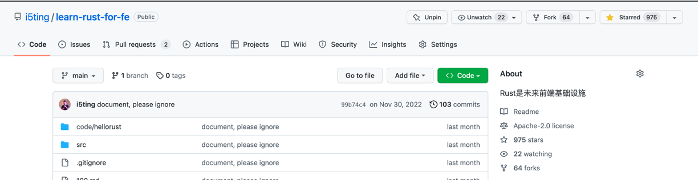

Rust 语言在前端工具链的影响越来越大，目前可以看到 Next.js 对 Rust 重仓，招揽大量人才，swc 作者，Rollup 作者等等，未来可能是一个很好的解决前端体验的方向。 

《Rust Is The Future of JavaScript Infrastructure》一文作者是 Vercel 的开发者关系主管，这篇文章和我的观点一样，自备梯子。 很多东西都是上错花轿嫁对郎，比如 MVC，比如 Node，如今又多了 Rust。必然雄起！未来随着 WebAssembly 普及，Rust 才能变成应用级别的。

其实，很多经典的Rust库在blessed.rs网站上都是有的，上面内容非常全。我对Rust模块的看法是都偏底层，比如CLI用的最多的就是clap，类似的模块远没有Node.js世界里百分之一，这意味着Rust社区比较喜欢深耕，不喜欢搞各种创新。另外，从功能上clap这种就属于刚好够用的，这和cargo类似，基本相当于低配版的pnpm。之前和粉丝们开玩笑，狼书三卷出完了，如果再出卷4，我的唯一选择就是《狼书卷四：Rust从入门到弃坑》，这是玩笑话，也是真实想法，我非常认同Rust对大前端和Node.js的未来影响。

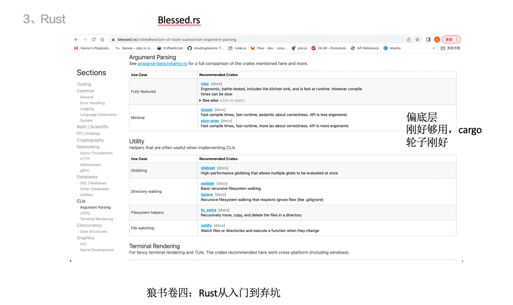

我的小兄弟十忆在2022年写了一个v8-profiler-rs模块，v8-profiler-rs 是一个使用 Rust 开发的用于在线智能化的分析 V8 heapsnapshot 堆快照的项目。帮助使用到 V8 引擎的应用开发者，例如Node.js/Chrome/Deno/Electron 等程序，旨在帮助开发者更直观的理解程序内存结构以及辅助定位内存泄漏问题。这里面技术点还是非常复杂的，需要熟悉v8，还要用rust重写，里面算法部分还是非常多的，比如支配数算法。

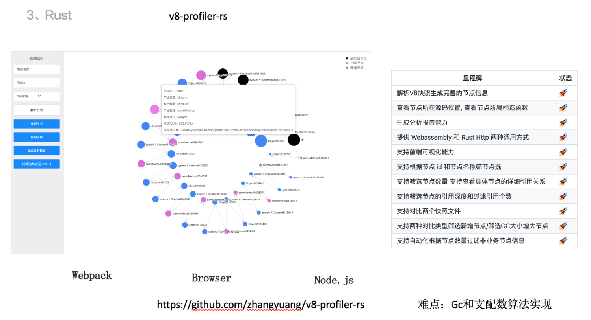

其实，它实现了多少功能不重要的，重点要的是它能够代表趋势潮流。从Swc到Turbo到v8-profiler-rs，基本上前端工具链已经被Rust实现差不多了，比如ESLint就曾在Issue里说要用Rust重写，类似的事儿比比皆是，综上种种，我个人对Rust打造前端基建是非常有信心的。

### 总结
2022年，从性能，运行时，体积等多个方面讲了前端趋势，同时Rust正在变为前端新基建，整体上看前端趋于成熟，更多的都是做的是深耕，优化的事儿，这些对用户和开发者都是极好的。
如果说只能推荐一个，那就只能是Next.js。虽然Next.js和张宇昂写的ssr框架是竞品，我个人不是很喜欢Next.js后面的改进，但它确确实实是好东西。

1、它是一个开箱即用的框架，从SSR开始做，然后转型开箱即用的应用框架，支持CSR，支持SSG，支持各种优化，连图片、字体、SEO等很多小细节都扣的极其细致。这对新手极其友好，所以大家的好感是极好的。
2、除了框架自身做的好用，简单，强大外，搭配Vercel云服务，一条命令完成开发和部署，这一点也是对开发者极好的体验。
3、Vercel对 Rust 重仓，招揽大量人才，swc 作者，Rollup、Webpack 作者等等，对Turbo这种基建硬核的事儿有勇气有能力，我是非常佩服的。

有Vercel打样，引领前端趋势潮流，未来很多框架都会趋之若鹜，关注开发者体验的，这才是真正的大好事。

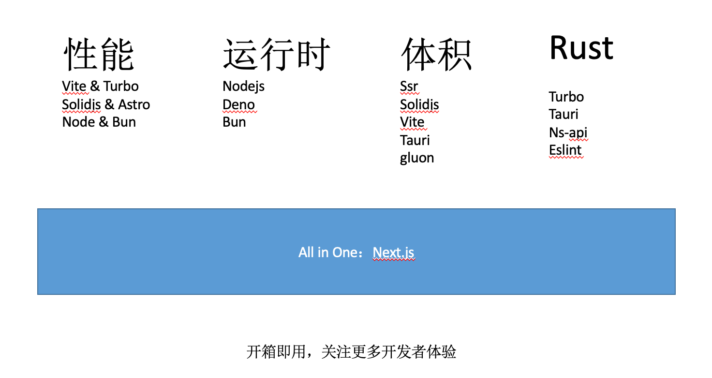

## 年度大戏（低码）：又一次全栈，至暗时刻还是新机会？

每年都会做一次年度总结和趋势预测，以往我对前端趋势都是比较乐观的，但在今年，此时此景，我竟然有一种莫名的惆怅，因为今年可能是至今为止变化最大的一年。对应标题中的全栈，可能大家都熟悉，但今天我要讲的是“又一次全栈”，低码全栈，是我以为的未来发展趋势。在当前前端成熟度和技术突破的结果上，催生低码全栈，继而导致工程师角色的变化，可能是前端的至暗时刻，也可能是新的机会。本文主要探讨这个问题，相信能够给大家一些不一样的输入。

### 全栈历史
讲到全栈，大家的都是既熟悉又陌生，且褒贬不一。按英文解释，全栈是fullstack翻译过来的，在JavaWeb时代其实是不讲全栈，只是Java工程师里，有Java Web工程师这个分类而已。在这个角色里，开发者需要会Java SE基础，掌握JavaEE，会写jsp、servlet、javabean，会model1和model2，会ssh框架，做的最多的事儿就是针对db的crud。至于ibatis等都是额外的零食。那个年代能折腾的其实很少，比如nutz算不错的开源项目，fastjson也不错，剩下的就是各种apache的包，结果最终大一统到spring全家桶了。这时候的Java Web工程师其实就是全栈工程师了。

在2005年，Ruby on rails作者dhh通过15分钟编写一个blog，震惊世界。一下子ruby和rails成了效率工具，确实ruby很优秀，简洁，结合强大的元编程能力可以实现很多超能力（黑魔法），在rails里通过脚手架，以及视图抽象等，才使得15分钟写1个blog成为现实。ror的影响一直持续到现在，很多语言里的框架都是借鉴rails的，比如目录结构，脚手架实现。在《狼书》卷三里，自己动手写企业级Web框架，其实也是借鉴了rails写法的。

**无论Java Web工程师，还是RoR工程师，他们都是一个人搞定开发，从db到视图，从开发到发布运维，这就是早起的全栈**。所以很多那个时代过来的人都会认为全栈就是全干的说法，事实上看确实没错，不过是自我调侃而已。这时候的前端非常原始，基本上js能写一些表单处理校验，动画处理基本就够了，最麻烦的大概就是浏览器兼容了，于是各种prototype，motools，jquery等应运而生。说白了，这些都还是工具属性，所以，这时候的前端，基本上是全栈工程师的加分技能而已，还不是一个角色。

随着互联网的崛起，在2005到2009年之间，前后端开始分离，标志性事件应该是淘宝最先引发的，前端开始更多的关注UI表达、浏览器兼容性，组件复用，性能优化等。于是在工具库之上，开始出现各种ui库，比如jquery-ui，我理解是原始ui框架的开始。然后是extjs，通过class方式定义ui，在企业级开发里被大量使用，很多ui框架都开始迷信面向对象（oop）能够解决ui复用问题。在一个连oo机制都不完善的语言里，自己实现oo写法是那个时代特有的特征。无论如何，专业化分工，带来的工程师职业发展的更多可能性。这个阶段，很多前端都会自嘲为切图仔，甚至还有专门的css重构工程师。

对前端影响里程碑事件的是2009年，Node.js诞生，它对前端工程化落地提供了基础。虽然本意是解决c10k问题，却误打误撞，变成了前端基础设施。通过js能够写构建，解法了前端很多禁锢。从写一点简单构建脚本，到grunt、gulp，基本上你能想到的构建都涵盖了，甚至连服务器运维都有一整套js工具链。如果仅仅是构建方面增强，其实是说小了，node其实是打开了工程师的想象力，当js具备io读写功能，自然就是编译的良好实验场。再加上各种js自身痛点（比如模块规范缺失），ruby等其他语言影响，于是出现了ejs这样的模版引擎，coffee这样的类ruby语法的转译器，从ruby解决的scss等，于是潘多拉魔盒被打开了。像新文化运动一样，前端开始不满足“切图仔”的角色，而是想打造更好的前端。随后backbone，angular、react、vue等依次登场，后面就是大家熟悉的话本了。这里要讲的是，从简单构建到bundler是一个跨越。事实上，2013年之后，曾经能搞定jQuery的那波Java大佬已经搞不定React了，原因是概念太多，前端不成熟，没有cra这样的东西，于是彻底切断了前后端的分工。
按墨菲定律，凡是可能出错的事有很大几率会出错，引申到Node.js身上也是一样的，它是什么，它就该做什么。当前端掌握了这个大杀器，不搞点事情怎么可能呢？于是早起的MEAN新一代架构便应运而生，说白了，就是mongdb、express、angular、node四个当时先进技术的，这其实也是上一代全栈的延伸。

除了MEAN外，还另外一个概念就是BFF，backend for frontend。就是所谓的api胶水层解决方案。最初bff是为了解决ios，android等移动端和pad、pc的api聚合问题而被thoughtworks提出来的，反正是胶水层，难度不大，用node写更合适。另外一个契机是互联网架构的演进，从前后端分离，慢慢固化到ui，api，rpc和db四个部分。在这种架构下，api层聚合，需要的是前端能搞定，性能好，快发简单，这种场景下舍Node其谁。所以从我个人角度来看，bff才是第二个的全栈阶段。从专业化分工到胶水粘结，确实是非常高效的。在《狼书》卷一和卷三大量讲的内容都是这件事，搞来搞去也无非缓存，RPC、MQ。在卷二里讲的Web开发，其实也是BFF必须掌握的技能。

至此，我们讲了2个全栈高潮期，具体如下。
1、从Java Web到RoR，引发的“全干” fullstack。这个阶段，全干是精髓。
2、由Node.js引发的API胶水层革命，即bff层fullstack，这个阶段是再互联网四大件体系下，前端和API胶水层全干。也有个说法，这叫前端3.0，本质没变，都是想拓宽前端的职能范围。

时至今日，前端框架混战，爆发式增长的阶段已经过去了。2020年之后，已经很少有人说学不动了，除了技术创新成本增加外，新东西增量也放缓，还有就是现有体系不断增加，比如cra，umi，next等越来越完善，基本上都是开箱即用的。各种ui库多的是，各种可视化，拖拽，编排也非常多，且垂类越来越好，比如3d、vr/ar/webassemly等生态。

那么，下一个正在发展中的阶段是什么呢？我以为是全栈的第三个阶段：低码全栈。如下图，表达了三个阶段的演进关系。

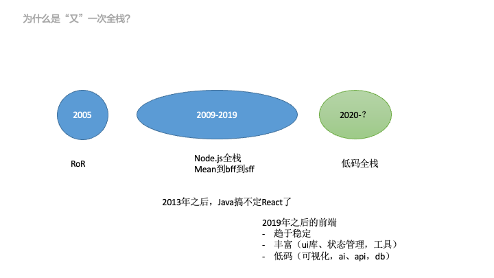

### 低码全栈
在2019年之后，前端技术趋于稳定，生态丰富，发展出很多对低码友好的技术生态。下面我们具体分析一下，低码全栈的历史必然性。

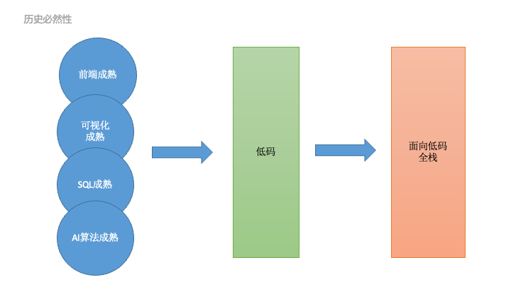

结合上图，从基建形成低码技术，继而出现面向低码的全栈。这里先讲解基建的必然性。

1）前端成熟，这个大家都可以理解。
2）可视化技术成熟，在前端生态里可视化已经相当够用了。各种画布，所见即所得，编辑器技术也得到大大的发展。都想干掉office，颠覆企业协作，这也是可以理解的。
3）SQL成熟，这里更多的是指DB层面的成熟，无论量，运维，还是oltp和olap融合，都是非常成熟的，至少目前的互联网应用是验证过的。各种SQl相关定制和实现也很容易，会SQL的人更是不计其数，好一点的PD都能自己搞定。
这里要讲一点不一样的内容，比如Byzer，将算法和SQL结合是一个很有趣的方向，社区里py类似项目也是有的。我们可以这样理解，在表单这种垂类应用上，借助算法模型，能够提供更多分析和实操能力。这个我理解才是趋势。
4）AI算法成熟，虽然AI普及很难，但在特定场景，真的是很好用。

以上四点是基础，但不是载体。我们目前能看到的，承载所有上面技术的是低码技术。

### 对前端带来的技术变化
下面我们看一下低码全栈给前端带来的一些变化，简单讲是服务下沉，给了一些技术变革的机会，以当下投资圈最火爆的retool为例。

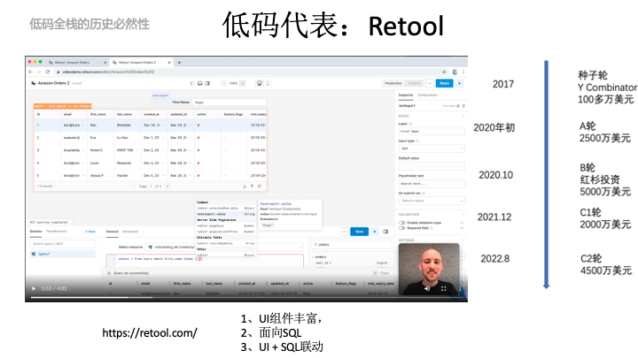

大家看去retool官网首页看一下这个视频，太震撼了。第一次看到五分钟可以搞定2个表格，按钮，过滤，联动。这种复杂度，对于绝大部分B端应用都够了。**其最大的创新是让ui元素和SQL字段联动，让ui元素和请求联动**。这样ui、sql、http请求就有机的结合在一起了。在上面4点基础之上，极大的放大了生产力，在当下经济环境下，大概这才是资本追逐的原因。

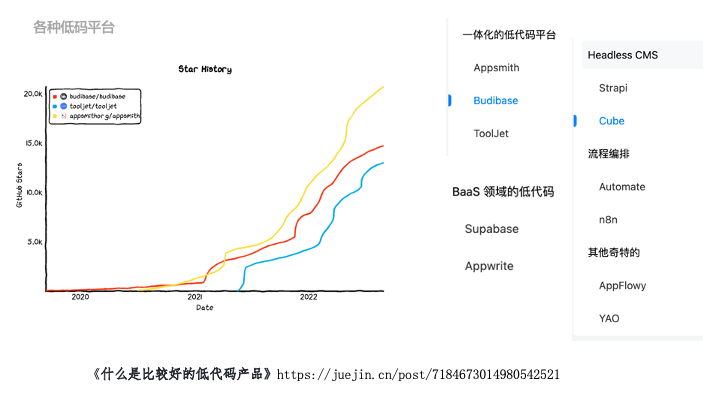

关于低码的更多介绍，推荐大家看一下侑夕同学的这篇文章，总结的还是非常棒的。

除了上面讲的历史必然性，我们还要低码和当下技术进行对比拆解，这样理解起来更容易。我们前面讲过第二个阶段全栈核心解决的是BFF，主要是胶水层。那么低码应该解决啥呢？

以retool的方式为例，它只保留ui和db，而rpc和api都变成了db上的增值服务，这样就减少了环节，也让问题定义更简单。

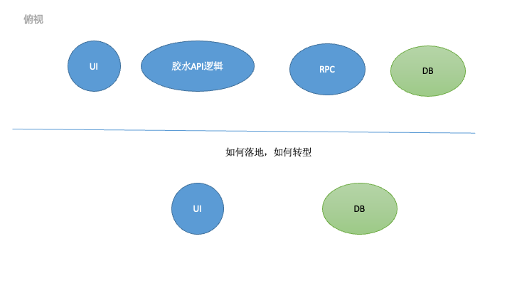

快手的车明君老师总结的低码本质，说的非常好。
1）通过技术提升生产力，继而减少需求
2）通过优化生产关系，减少中间环节，协作更高效

以前我的理解的生产关系优化是从PD到服务端，今天看来，这个观点可以更加开放一些，在技术上也是一样的。当我们再看到sql和ui元素组合的时候，你会震惊，这才是简化的力量。
从技术上提高生产力，从组织层面优化，从技术层面简化，三管齐下，解决绝大部分开发场景是够用的。约定式创新是没有问题，确实降本提效。至于是不是杀鸡取卵，大家可以各自发挥。从我个人视角来看，这是趋势，一个人能够做更多事情，借助生产力工具，减少协作流程，这一定是高效的。回到标题，“又一次全栈”，我想把第三个全栈定义为低码全栈就是这个原因。

低码全栈是技术发展和融合背景下提供的业务快速交付方式的创新。不管大家是否愿意，这样的改变都正在发生。试想当年运维工程师，在2000左右都是车接车送的，2010年基本就消失了，继而转换成devops和平台工程师，事情其实还是在的，比如MoeLove（张晋涛）做的k8s相关研究也在这个范围里。

对于前端工程师来讲，也面临同样的问题，转型成全栈或平台前端、垂类前端。我在文章最前面说，这可能是前端的至暗时刻，也可能是新的机会。就是这个原因，优胜劣汰会使得很多人要接受变化。

但换积极的角度看，有了retool这样的平台，也同样会催生出使用这样平台的人，我们假定这个角色叫retool工程师，需要掌握sql和低码操作，完成页面快速交付，这其实也是一个新的全栈角色。对于工程师来说，这也是一个新的选择。

在低码背景下，前端也会有一些技术选型上的变化，具体如下。

首先低码是基于页面维度的，所以页面托管服务是必备的。也就是说狼三里page as service依然实用，甚至要把csr和ssr都统一到一起。

其次是微前端成为基础设施，这个和微前端诞生初心一样，新老系统难免整合。

之后是MPA大行其道，以前spa是为了缓存公共资源文件，提升加载速度，体验更好。但在低码里都是独立页面，这种情况，很明显是多页应用更好，每个页面都是独立的，独立服务，按需开启ssr或csr，是必然结果。

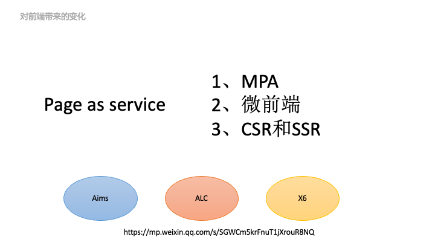

当然，优秀的开源项目，比如aims，alc，x6等都会有比较不错的增量，享受趋势红利。还有整合性的，比如apitable等也是我非常看好的。

### 举例

技术变化其实是小的，真正的难的是选择。如下图，我整理了2个方案。

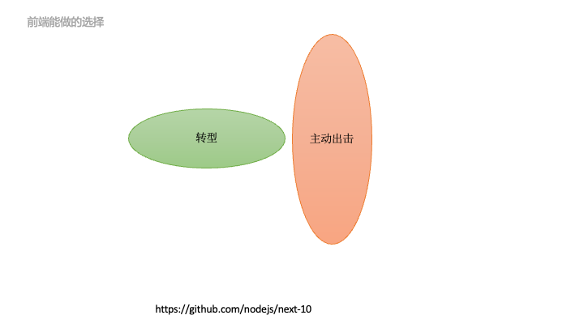

1）拥抱变化，积极转型全栈。大部分的只能这样选择
2）主动出击，做好bff，去分一块服务端的业务。

技术本身变化并不大，但融合会导致工作内容变化，继而是角色变化。其实还有平台前端，或者说专业前端可以选择，当然，这个范围会慢慢变小。垂类前端也可以，比如做互动游戏，3d，xr，音视频等小众。当然也可以尝试web3。

下面说一个我的例子，2022年把ts-junit写完了第一版，写这个目的就是让熟悉Java的同学能够以他们熟悉的方式写测试。当然，这不一定是真命题。只有全栈统一，这样的需求才会变多。

我的做法是选用junit写法， 用ts去实现。

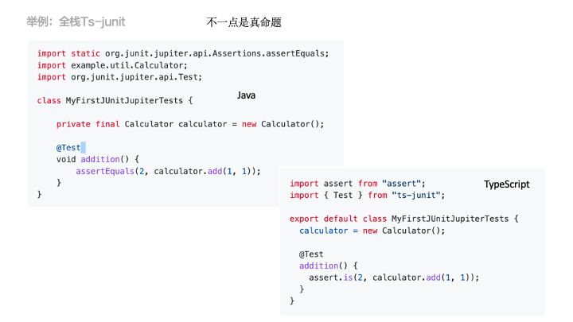

技术选型上，选择了uvu做执行引擎，里面用了策略模式和模版模式做了一点扩展点，可圈可点。

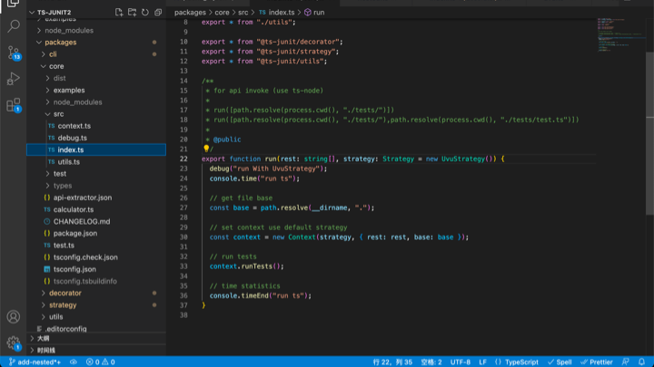

下面是ts里的具体技术栈，还算是比较常规的内容，具体如下。

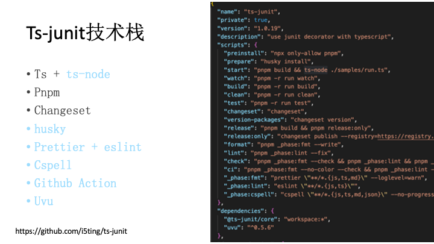

### 总结

文章中，我们讲了3个全栈高潮期，具体如下。

1、从Java Web到RoR，引发的“全干” fullstack。这个阶段，全干是精髓。
2、由Node.js引发的API胶水层革命，即bff层fullstack，这个阶段是再互联网四大件体系下，前端和API胶水层全干。也有个说法，这叫前端3.0，本质没变，都是想拓宽前端的职能范围。
3、低码全栈是技术发展和融合背景下提供的业务快速交付方式的创新。从技术上提高生产力，从组织层面优化，从技术层面简化，三管齐下，解决绝大部分开发场景是够用的。

由低码技术发展而衍生出的全栈，可能会导致工程师们角色的又一次变化。文章中举例了运维工程师的变化。当然，也写了一些前端的变化和应对方案。最后举了ts-junit的例子。这是残酷的现实，所以我说这可能是前端的至暗时刻，也可能是新的机会。

其实，身在变化中的人都会难受，重要的是心态。无论大家愿意与否，改变都在发生。坚持学习，每日精进才是解法。

## 2023年就业情况分析
整体上，我对前端的状态是趋于成熟，已经过了第一波爆发式增长期，但它还在垂类细化领域不断发展中，所以我还是非常看好的，前端按照波士顿矩阵说法，大约处于明星和金牛中间，整体上发展还是非常好的。交代完背景，再看就业情况分析。
### 前端局势算很差吗？
先说结论，整个互联网局势都很差，从人才济济到“人才挤挤”，我理解的原因就是经济环境和行业发展遇到瓶颈，更深层次的分析我就没能力分析了。有了这个命题，加上前端是互联网中的一个工种，这就意味着前端在互联网局势很差的情况下也会很差。

其实，最可怕是马斯克收购Twitter搞一波裁员，如果打破投资圈对技术崇拜的魔咒，那才是最可怕的。以前互联网朝气蓬勃，产品都是做加法的，举例电商做品类拆分细化，越做越大，还有pdd，那时候能拿钱砸出来，现在就未必了。另外，很多产品都功能做的过于丰满，把自己定位甚至都改了，真是把mvp理解的太到位了，从Minimum Viable Product到Maximum Viable Product都理解到了。 以往裁员都是销售类等挥之即来的岗位，如果因为产品功能饱和而裁员技术，这才是最可怕的。

事实上，前端是去年在互联网如此糟糕的局势里比较好的工种。参考[https://octoverse.github.com/2022/top-programming-languages](https://octoverse.github.com/2022/top-programming-languages)，这应该和各位读者理解的差不多，JavaScript依然是一骑绝尘，冠绝一时，连Typescript都能排在第四，可见前端技术使用度占比之高。

> JavaScript continues to reign supreme and Python held steady in the second place position over the past year in large part due to its versatility in everything from development to education to machine learning and data science. TypeScript also held firm in fourth place year-over-year. Notably, PHP dropped from sixth to seventh place in 2022.

具体数据如下。
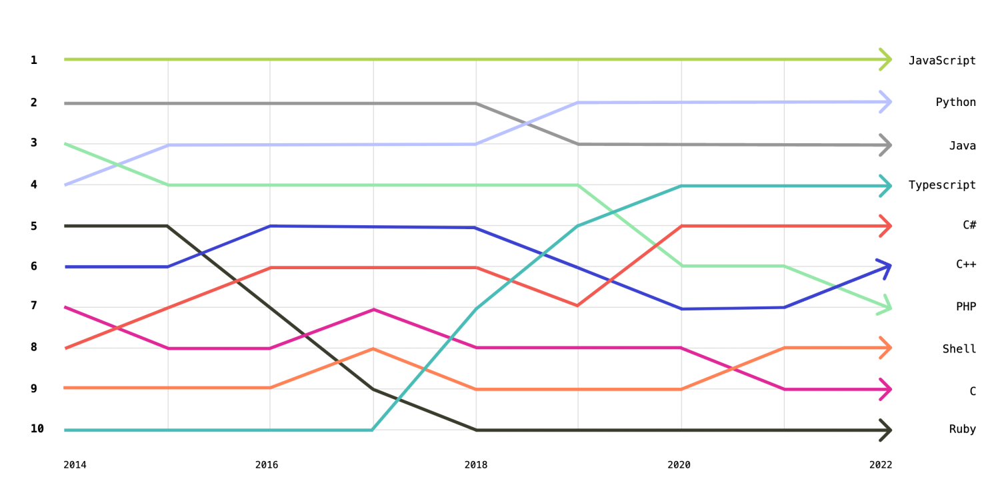

根据DevJobsScanner网站统计，时间是从Oct-2021 到 Nov-2022之间，从1200万个工作机会中进行筛选的记过。数据如下。

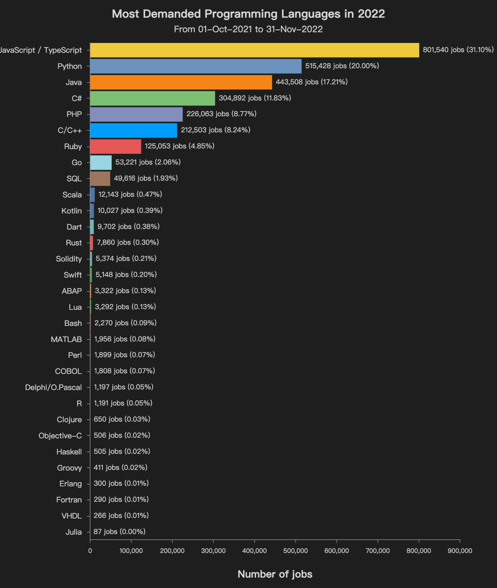

从图中，我们可以得知，JavaScript / TypeScript相关工作高居榜首，这意味着前端相关技能适用面非常广泛。虽然这是国外的数据，放在国内不一定完全适用，但它至少可以佐证，前端是在国外是需求旺盛的工种。参考[https://www.devjobsscanner.com/blog/top-8-most-demanded-languages-in-2022/](https://www.devjobsscanner.com/blog/top-8-most-demanded-languages-in-2022/)，把上图进行简单梳理，可只前端需求量依然最大。

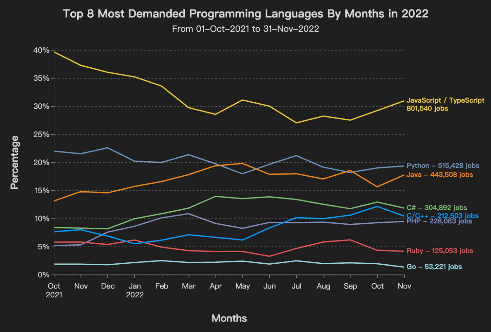

辩证的看，前端技能和前端职位数成正比，这是正常的。这一点国内和国外的是没有区别的，多端和跨端，Node.js等混合成为大前端，守好体验和效率的门卫，当然是必不可少。

下面回复3个相关提问：
> 提问1：请教下大佬，现在前端局势算很差吗，作为一个前端校招新人而言应该朝哪个方向发展大佬有什么推荐吗

整个经济形势都不好，不只是前端。不过是比不得前几年而已。整体看，还算健康的，精深专业人才还是需要的。

> 提问2：前端最悲观的前景在于需求越来越外包化，很可能将来的趋势是除了行业顶端的企业需要少量的金字塔顶前端，其他前端都只能吃外包的饭。

一个不盈利的创业公司他不需要关注体验，而是完成功能。当求发展时才有体验需求，这时候才要专业的人。所以你这个观点有点以偏概全了，且悲观。我的观点，几乎任何行业都类似的，努力进大厂，然后独立，玩出乐趣，才是好事。

> 提问3：2022年的前端岗位在逐渐外包化（几个大厂带的头），工资 10k~20k 的外包岗位很好就业，但是 20k 以上的就难找不少了。

至于20k以上少的论断，我不认同。经验能力和薪资必然正比。只是选择上会更谨慎。如果再直接点，就是你看到的就是你看到的，不一定是别人看到的。

就业形式相较而言还是不错的，受大的经济环境和前端趋势影响，很明显，前端外包化严重，专业前端细分化，但变化（危机）也要来了，在低码和AI共同作用下，新的融合性岗位已经慢慢在出现了。下面具体讲讲我的理解。

### 1、外包化严重
没有增长的公司大致是会维持或降本。对于技术来说，除了服务器等软硬件采购，就是人力成本。出于降本的考虑，一些能够由成本不高的人能够完成的活，就不会让高成本的人来做。所以说，外包化是整个互联网行业都在做的事儿，不单单只是前端。

对于前端来说，门槛不高，技术成熟度高的工作是最容易外包化的。比如ToB端相关工作外包化就严重。原因很简单用户是内部人员，页面不追求极致体验，甚至是能用就行。另外，技术上没有新框架，React这种框架使用上还是很好用的，所以ToB端CRUD能外包的就外包。

熟练外包确实是好的，但外包和正式比例短期内还是正式更多。大家也不必过度担心，java至今也没有外包比正式多，只是会让大家去追求专业度更高的事儿，这其实也是好事。

外包是一种常态化选择，不只是在裁员潮下面，外包和技术提效一直都有，只是在局势不好的时候，它会被放大，甚至引起很多人的恐慌。业务萎缩，挤掉些水分是正常的，但这不是行业坍塌，需求量依然还在的，对我们而言，更多的调整好心态，强大自己，技术过硬，与时俱进就好。

就未来讲，真正惨的事儿不只是外包化，而是正式员工干外包的活，外包被辞退，这也是非常有可能的。比如类似国企性质的公司，不方便辞退的公司，大概率只能这样选择。成本优化，很多时候是先挤掉水分，然后清理外包，正式员工加量不加价（降薪不好操作），正式流失，扛不住的时候再补外包。

### 2、高级岗位变少
前端领域里所谓的架构师类(或者说专家类）比例还是非常多的。前端为什么会高级岗位很多，其实是2013到2019年的前端爆发期有关的。以前Java同学还能写jQuery，但到了React时代，搞定Webpack，sass，TypeScript等等，他们就显得力不从心了，专业前端都很痛苦，何况他们。所以那个时候非常细化招高级岗位，除了解决问题外，还有很多基建的建设。

随着基建的完善，比如create-react-app(cra)、Umi、Next.js这样的基建成熟，如果只是单纯做业务，我们还需要那么多高级岗位吗？明显是不会的。从成本角度看，高级岗位的成本，大家也是心里清楚的。所以我的判断是高级岗位会变少，很有可能会慢慢变成架构师角色，比例和Java等差不多。

高级岗位溢出的人，创业、转管理、转型也都是好的，学学Winter、Hax、Phodal、安晓辉、神光、程军，王晔亮（头哥侃码）其实也挺好。像TL这种比例不大动，变化不大。优胜略汰，正常比例，只是流动量少，竞争会非常激烈。
### 3、专业前端细分化
专业前端，依然是大多数，比如c端这种重体验的必须专业前端，还有垂类，比如互动游戏，3d，webrtc这种有专业难度的小众分类也必须专业前端，比如可视化编辑器，AFFiNE，QUill，X6这种都是需要专业前端的。

技术的边界，其实已经在打破了。比如以前说浏览器里无法操作DB，传统数据库都是要通过TCP进行连接，请问前端如何连接？基本上无解，Web缓存不算。目前见到的奇技淫巧是sql.js-httpvfs，通过WASM+Webworker搞，脑回路甚至不一样。其次，前端范围放大，Server Page也算前端，那就有了ASP，JSP，PHP等等，这些都是可以连接数据库的。尤其是 http://asp.net 玩的很棒的。再看，前后端分离下，为什么呢？写到一起没分层，代码不好，不适合大规模开发。部署到一起，没法借助CDN优势，也没法保障高可用。最重要的是专业化分工。

最近也看到AlaSQL.js，也是可以跑在浏览器是的RDBMS，未来浏览器就是现在的OS，对此我深信不疑。AFFiNE其实在做本地存储，目前看可能是基于SQLite做的。再加上去中心化的玩法，浏览器既是OS，又是Client，这样的日子还会远吗？

在我看来，发展中的企业依然是按照专业分工工作，成熟的公司更愿意搞全栈，降薪不好操作，就只能加量不加价。目前看，前端垂类，其实是最吃香的部分。

### 4、岗位融合新机会
岗位融合，对于Retool带来革命性的交互方式，会颠覆很多角色的，包括前端、服务端、数据分析等。未来可能会出现低码工程师，或者类似全栈工程师这样的胶水类岗位，也是非常有可能的。大家把心态放宽，没工作是很难的，最怕的自己放弃自己，坚持每日精进，又怎么会被时代抛弃呢。

在本文中《年度大戏（低码）：又一次全栈，至暗时刻还是新机会？》一节里，已经有了全面的叙述，这里就不再赘述了。

体力活和技术含量低的活儿慢慢被技术升级所替代，这在任何时代都是必然的事儿。

## 小结
回顾一下前面讲的内容：

- 讲了2022年趋势
   - 1、性能 
   - 2、运行时 
   - 3、体积 
   - 4、Rust正在变成前端新基建
- 讲了年度大戏（低码），retool类低码系统会颠覆很多角色的，未来可能会出现低码工程师，或者类似全栈工程师这样的胶水类岗位。
- 讲了2022就业情况，局势很差，不只是前端，而是互联网很差，前端也很差，很有变化，但大盘需求不会有特别大的变化。

在2023年，端正态度，做好技术才是正经事。小胡子哥说：“想做一件事情，看到的全是方法，不想做一件事情，那看到的就全是借口。意愿、态度或者说兴趣，才是个人发展的第一生产力”。摆正心态，积极面对。如果不热爱，请热爱，不然做不好的。我很认同他的说法，不管是工作还是学习，其实都是：知之者不如好之者，好之者不如乐之者。我经常说，编程本身是无趣的，玩出乐趣，才能做好编程。

按常理，文章后都是要展望一下未来。对于未来来说，我们还是要重视趋势的影响，对低码，AI，去中心化等技术还是保持关注和学习，最好能每日精进，与时俱进。对于AI和去中心化等技术，我是持悲观态度的，和Vic talk的推文想法类似：“AI提高生产力，Crypto提升资本利用效率，一起创造新的庞氏”，这话说的虽然很那露骨，但确实是趋势。如果拿不准，每日精进，学习能力在，还会怕技术变革吗？

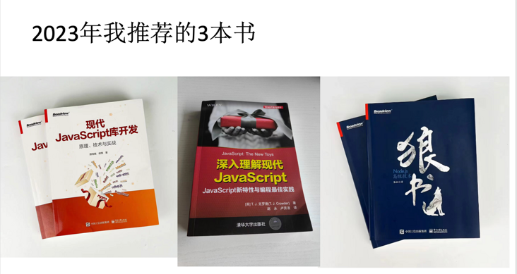

狼叔说：“少抱怨，多思考，未来更美好”，社会需要专业人才，喜欢就坚定的做，热爱才是救赎最好的药。

**狼书三卷已出版，感兴趣的同学加我的微信langshunode，可以加读者群。**
